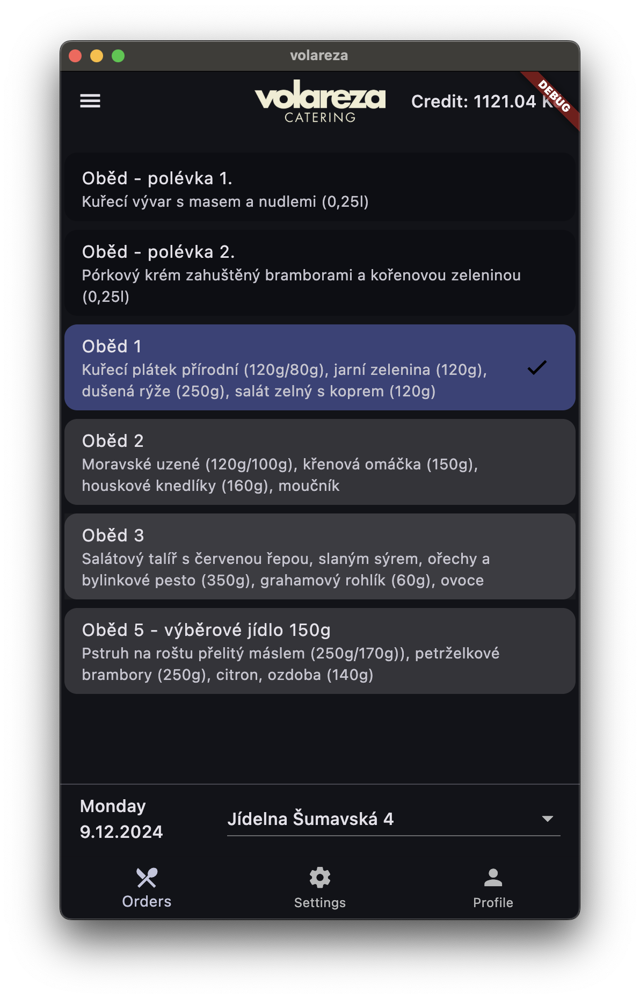
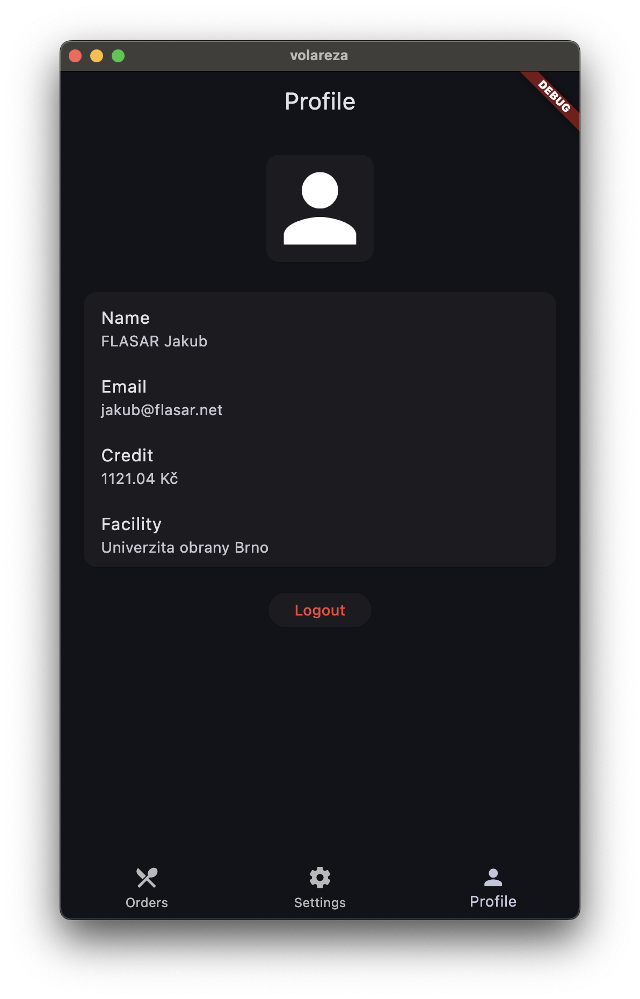
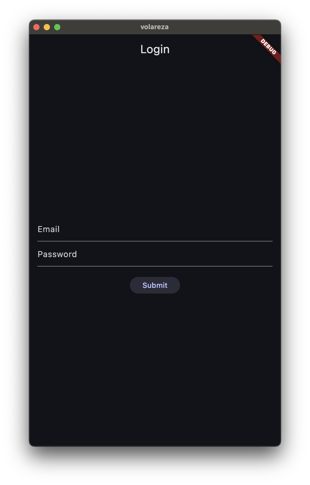

# volareza - mobilní aplikace na objednávání obědů

Mobilní aplikace volareza zjednodušuje proces objednávání a správy obědů pro studenty a zaměstnance
Univerzity obrany. Nabízí intuitivní rozhraní pro správu jídelníčku, objednávek přímo z mobilního telefonu.
Aplikace je navržena s důrazem na rychlost a jednoduchost použití.

## Funkcionalita
- přihlášení uživatele (LoginScreen)
- automatické přihlášení (LoginScreen)
- objednání oběda / zrušení objednávky (OrderPage)
- výběr jídelny (OrderPage)
- přehledný kalendář objednávek (OrderPage)
- zobrazení kreditu (OrderPage)
- přehled profilu (ProfilePage)
- několik barevných schématů (SettingsPage)
- světlé a tmavé téma (SettingsPage)
- uložení nastavení (SettingsPage)

## Plánovaná funkcionalita
- možnost zapnout/vypnout notifikace (SettingsPage)
- vygenerování QR kódu pro platbu (ProfilePage)
- odkazy na oficiální stránky volareza (ProfilePage)

## Technologie
- Flutter
- HTTP požadavky na API (https://unob.jidelny-vlrz.cz/)

## Sestavení aplikace
- nainstalujte Flutter (https://flutter.dev/docs/get-started/install)
- stáhněte si projekt: `git clone https://github.com/jakubvf/volareza.git`

### Spuštění aplikace na počítači
```flutter run```

### Vytvoření APK souboru (Android)
```flutter build apk```

### Vytvoření IPA souboru (iOS) - netestováno!
```flutter build ios```


## Snímky obrazovky




