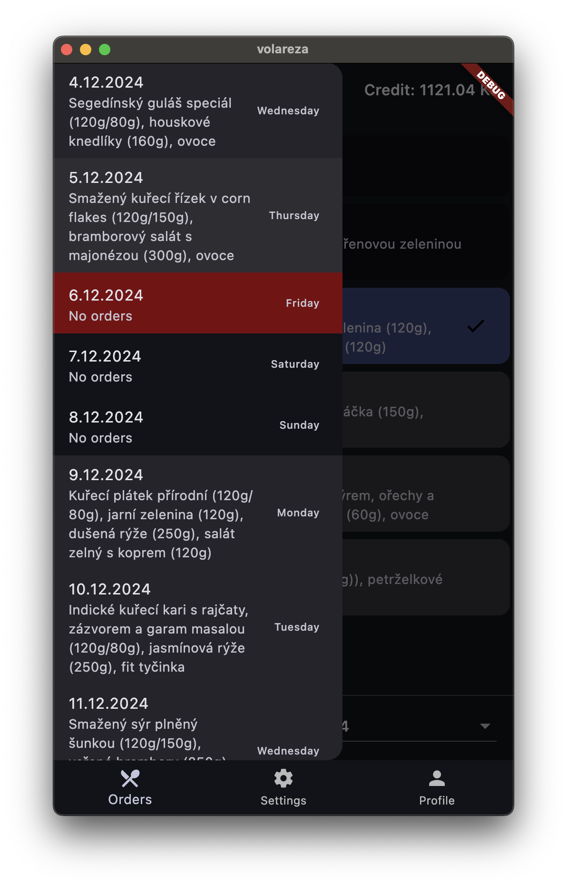
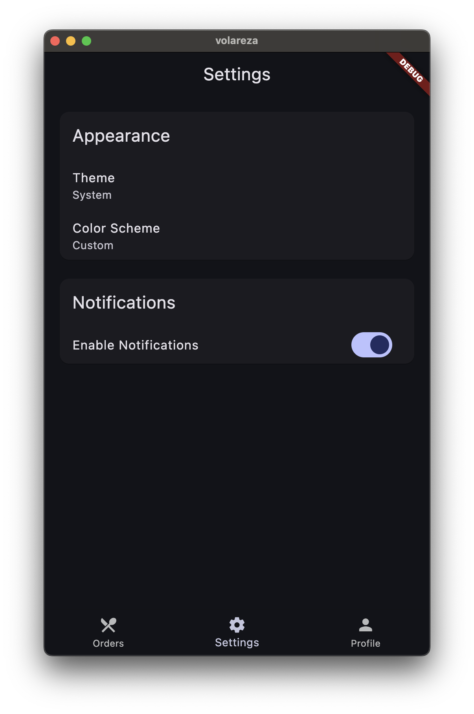

# Moje UO - mobilní aplikace pro rozvrh hodin

Mobilní aplikace Moje UO poskytuje přehledný rozvrh hodin pro studenty a zaměstnance
Univerzity obrany. Nabízí intuitivní rozhraní pro zobrazení rozvrhu s možností 
procházení jednotlivých dnů a detailů událostí. Aplikace je navržena s důrazem 
na rychlost a jednoduchost použití.

## Funkcionalita
- přehledný kalendářový rozvrh hodin (TimetablePage)
- procházení rozvrhu po dnech pomocí swipe gest
- detail jednotlivých hodin a předmětů (EventDetailPage)
- týdenní a měsíční zobrazení kalendáře
- filtrování pouze pracovních dnů
- nahrání dat rozvrhu z JSON souboru
- několik barevných schématů (SettingsPage)
- světlé a tmavé téma (SettingsPage)
- uložení nastavení do zařízení

## Technologie
- Flutter
- Drift databáze pro lokální úložiště rozvrhu
- Table Calendar pro kalendářové komponenty
- Shared Preferences pro uložení nastavení

## Sestavení aplikace
- nainstalujte Flutter (https://flutter.dev/docs/get-started/install)
- stáhněte si projekt: `git clone [repository-url]`
- spusťte: `flutter pub get`

### Spuštění aplikace na počítači
```bash
flutter run
```

### Vytvoření APK souboru (Android)
```bash
flutter build apk
```

### Vytvoření IPA souboru (iOS)
```bash
flutter build ios
```

### Generování databázového kódu
```bash
dart run build_runner build
```

## Struktura aplikace
- **lib/main.dart** - vstupní bod aplikace
- **lib/timetable.dart** - hlavní stránka s rozvrhem
- **lib/SettingsPage.dart** - nastavení aplikace
- **lib/database.dart** - definice databáze
- **lib/event_detail_page.dart** - detail události/hodiny
- **assets/rozvrh.json** - data rozvrhu

## Historie změn
Aplikace byla původně vyvinuta jako "Volareza" pro objednávání obědů. 
Kód pro objednávání jídel byl přesunut do větve `volareza` a hlavní 
větev byla přepracována pouze na zobrazení rozvrhu hodin.

## Snímky obrazovky

